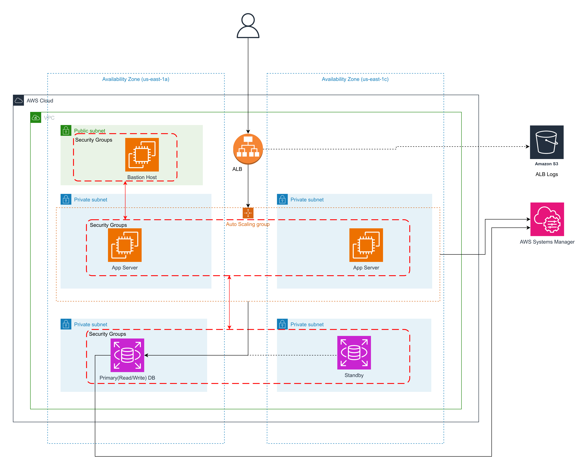

# terraform-aws-asg
Terraform with auto scaling groups

# Architecture


Deployment of simple django application with Multi AZ, ALB, ASG, RDS and Terraform.

Terraform is used for creating the underlying infrastructure on AWS.

Bastion Host is used for accessing Web Servers without exposing web servers to the Internet. Web server and RDS instances are placed on private subnets with Multi AZs.

Userdata is used for configuring and installing docker and web applications on web servers.

ALB is used for distributing traffic across Auto Scaling Groups instances and perform health checks on instances.

## Creating the above infrastrcture

Uses S3 bucket for storing terraform state files and DynamoDB for state locking.

`config.s3.tfbackend` file is used for configuring s3 bucket and dynamodb as remote backend for terraform. The necessary s3 bucket and dynamodb should be created manually as it is not managed by terraform. We want to avoid deleting those services when destroying infra with terraform. 

`dev.tfvars` file containes the name of the bucket which will be created and used for storing ALB logs.

```bash
terraform init

terraform plan -var-file="dev.tfvars"

terraform apply -var-file="dev.tfvars"
```